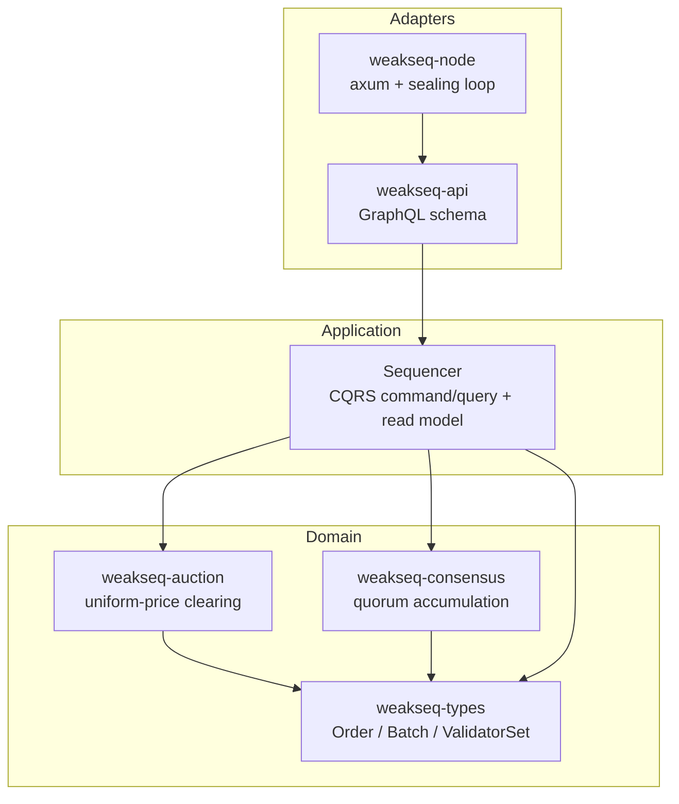
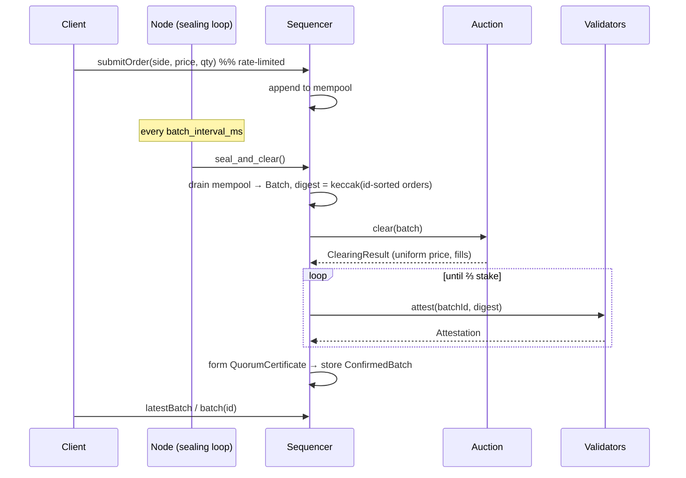

# WeakSeq

[](https://github.com/ABHIJEET-MUNESHWAR/WeakSeq/actions/workflows/ci.yml)
[](https://www.rust-lang.org)
[](LICENSE)
[](https://github.com/rust-secure-code/safety-dance)


> A **block-less, weak-consensus batch-auction sequencer**. Orders are collected
> into short epochs, cleared at a single **uniform price** (eliminating intra-batch
> ordering MEV), then finalized by a **stake-weighted quorum certificate** — a weak
> (fast, single-round) confirmation rather than full BFT total-ordering.

---

## Table of Contents

- [Why WeakSeq](#why-weakseq)
- [Architecture](#architecture)
- [Lifecycle](#lifecycle)
- [Crate Reference](#crate-reference)
- [Getting Started](#getting-started)
- [GraphQL API](#graphql-api)
- [Design Principles](#design-principles)
- [Test Results](#test-results)
- [Benchmarks & Complexity](#benchmarks--complexity)
- [Self-Evaluation](#self-evaluation)
- [License](#license)

---

## Why WeakSeq

Classic sequencers impose a **total order** on transactions, which is both a
consensus bottleneck and the root of ordering MEV (front-running, sandwiching).
WeakSeq takes the opposite stance:

1. **Order-independence within a batch.** All orders in an epoch clear at one
   price computed from aggregate supply/demand. Re-ordering inputs cannot change
   any participant's outcome — the batch digest is computed over an *id-sorted*
   set, so it is identical regardless of arrival order.
2. **Weak consensus, not total order.** Validators only need to agree on *which
   batch digest* was produced, attested by a **⅔ stake quorum**. No leader
   election, no view changes — a single attestation round yields a certificate.

This mirrors the "weak sequencing / consensusless" design direction explored by
fast-DA and based-rollup research, distilled into a clean, testable Rust core.

## Architecture

Hexagonal (ports & adapters). Dependencies point inward; the domain crates
(`types`, `auction`, `consensus`) know nothing about GraphQL, HTTP, or Tokio.



## Lifecycle



## Crate Reference

| Crate | Layer | Responsibility |
|-------|-------|----------------|
| [`weakseq-types`](crates/types) | Domain | `Order`, `Price`/`Quantity` newtypes, `Batch` + order-independent `digest()`, `ValidatorSet`, `Attestation`, `QuorumCertificate`, `SeqError`. |
| [`weakseq-auction`](crates/auction) | Domain | `UniformPriceAuction`: deterministic uniform clearing price + fill allocation. |
| [`weakseq-consensus`](crates/consensus) | Domain | Stake-weighted quorum accumulation with anti-equivocation & idempotence; emits `QuorumCertificate`. |
| [`weakseq-api`](crates/api) | Application | `Sequencer` (CQRS: mempool commands + read model), governor rate limiting, `async-graphql` schema. |
| [`weakseq-node`](crates/node) | Adapter | Composition root: periodic sealing loop, axum server (`/graphql`, `/health`, `/metrics`), tracing + Prometheus. |

## Getting Started

```bash
# Build & test
cargo test --workspace

# Run the node (4 validators, seal every 250 ms)
cargo run -p weakseq-node -- --listen 0.0.0.0:8081 --validators 4 --batch-interval-ms 250

# Open GraphiQL
xdg-open http://localhost:8081/graphql
```

Docker:

```bash
docker build -t weakseq-node .
docker run -p 8081:8081 weakseq-node
```

## GraphQL API

Eight operations (GraphQL over REST — the surface exceeds five endpoints):

```graphql
mutation { submitOrder(side: BUY,  price: 100, quantity: 5) }
mutation { submitOrder(side: SELL, price: 90,  quantity: 5) }
mutation { sealBatch { batchId clearingPrice matchedQuantity fills attestors certificateWeight } }

query { status { healthy mempoolDepth confirmedBatches validatorCount quorumThreshold } }
query { latestBatch { batchId clearingPrice matchedQuantity digest } }
query { batch(id: 0) { batchId matchedQuantity certificateWeight } }
query { mempoolDepth }
query { validatorCount }
```

A ready-to-import [Postman collection](postman/WeakSeq.postman_collection.json) is included.

## Design Principles

- **Type-state & newtypes** — `Price`/`Quantity` reject zero at construction; a
  nonsensical order cannot be represented.
- **No `unwrap`/`panic` on runtime paths** — every fallible boundary returns
  `SeqResult`; `#![forbid(unsafe_code)]` across all crates.
- **Resilience** — governor rate limiting / backpressure on submission; consensus
  enforces anti-equivocation and duplicate rejection.
- **Async, non-blocking** — the sealing loop runs on Tokio with
  `MissedTickBehavior::Skip`; CPU-bound clearing is pure and cheap.
- **Observability** — structured JSON `tracing`, Prometheus counters/histograms
  (`weakseq_batches_confirmed_total`, `weakseq_batch_matched_qty`).
- **CQRS** — command side mutates the mempool; sealing produces an immutable read
  model of `ConfirmedBatch`es queried independently.

## Test Results

```
cargo test --workspace
```

| Crate | Tests | Focus |
|-------|------:|-------|
| `weakseq-types` | 14 | newtype invariants, order-independent digest, quorum threshold, QC verify |
| `weakseq-auction` | 7 | crossing/no-cross clearing, uniform price, fill allocation, determinism |
| `weakseq-consensus` | 6 | quorum formation, equivocation, duplicate, below-quorum, weighted stake |
| `weakseq-api` | 10 | submit/seal/query flow, rate limit, no-trade finalization, GraphQL |
| `weakseq-node` | 3 + 2 | sealing loop, router build, HTTP health + GraphQL integration |
| **Total** | **42** | unit + integration + GraphQL |

All green; `cargo clippy --workspace --all-targets -- -D warnings` clean; `cargo fmt --check` clean.

## Benchmarks & Complexity

Criterion benches live in [`crates/auction/benches`](crates/auction/benches)
(`cargo bench`).

| Operation | Complexity | Notes |
|-----------|-----------|-------|
| Batch digest | `O(n log n)` | sort order ids, then keccak fold |
| Uniform clearing | `O(k log k)` | `k` = distinct candidate prices; sort dominates |
| Fill allocation | `O(n log n)` | price-priority then id ordering |
| Quorum accumulation | `O(v)` per attestation | `v` = validators; hash-set dedup |
| QC verification | `O(a)` | `a` = attestors, sum of stakes |

Space: `O(n)` mempool + `O(b)` confirmed read model (`b` = batches retained).

## Self-Evaluation

| Guideline | Status | Evidence |
|-----------|:------:|----------|
| SOLID / modular / hexagonal | ✅ | 5 layered crates, inward deps, trait-based `AuctionEngine`/`ConsensusEngine` |
| Type-safety (newtypes, enums) | ✅ | `Price`/`Quantity`/`OrderId`/`ValidatorId`, `Side`, `AttestOutcome` |
| Error handling (thiserror) | ✅ | `SeqError` + `is_retryable`; no `unwrap` on runtime paths |
| Resilience | ✅ | governor rate limit, anti-equivocation, idempotent attestation |
| Async / Tokio | ✅ | sealing loop, GraphQL server, non-blocking |
| GraphQL over REST | ✅ | `async-graphql`, 8 operations |
| Observability | ✅ | `tracing` JSON + Prometheus metrics endpoint |
| Testing (unit+integration+GraphQL) | ✅ | 42 tests, clippy/fmt clean |
| CI/CD + Docker | ✅ | GitHub Actions (fmt/clippy/test/bench/docker), multi-stage Dockerfile |
| Benchmarks + complexity | ✅ | criterion benches + Big-O table |
| Postman collection | ✅ | [postman/](postman) |
| Generative/Agentic AI | ➖ | Not applicable to a deterministic sequencer core; MEV-fair clearing is intentionally rule-based, not ML |
| Anchor framework | ➖ | Not a Solana program; N/A |

## License

[MIT](LICENSE) © 2026 Abhijeet Ashok Muneshwar
