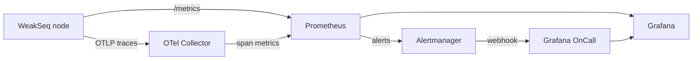

# WeakSeq Observability Stack

A complete, batteries-included monitoring stack for WeakSeq:

| Component | Role | URL (local) |
|-----------|------|-------------|
| **WeakSeq node** | App; exposes `/metrics` (Prometheus) and exports OTLP traces | http://localhost:8081 |
| **OpenTelemetry Collector** | Receives OTLP traces, derives RED span metrics | :4317 (gRPC), :4318 (HTTP), :8889 (metrics) |
| **Prometheus** | Scrapes metrics, evaluates alert rules | http://localhost:9090 |
| **Alertmanager** | Routes / de-dupes / inhibits alerts → OnCall | http://localhost:9093 |
| **Grafana** | Dashboards over Prometheus | http://localhost:3000 (admin/admin) |
| **Grafana OnCall** | On-call schedules & escalation | http://localhost:8082 |

> **Port note:** each project's stack binds the same host ports (3000, 9090,
> 9093, 4317, 8889). Run only one project's stack at a time, or edit the host
> port mappings in `docker-compose.yml` to run several in parallel.



## Quick start

```bash
# From the project root:
docker compose -f monitoring/docker-compose.yml up -d --build
```

Open Grafana at http://localhost:3000 → **Dashboards → WeakSeq → Sequencer Overview**.

## What is instrumented

**Application metrics** (`metrics` crate → `/metrics`):

| Metric | Type | Meaning |
|--------|------|---------|
| `weakseq_orders_submitted_total` | counter | orders accepted into the mempool |
| `weakseq_orders_rate_limited_total` | counter | submissions shed by the rate limiter |
| `weakseq_batches_sealed_total` | counter | batches sealed by the sequencer |
| `weakseq_batch_orders` | histogram | orders per sealed batch |
| `weakseq_batch_matched_quantity` | histogram | matched quantity per batch |
| `weakseq_batches_confirmed_total` | counter | batches confirmed by consensus |
| `weakseq_health_checks_total` | counter | `/health` probes |

**Traces** (OpenTelemetry): the node exports spans over OTLP gRPC when
`OTEL_EXPORTER_OTLP_ENDPOINT` is set (done for you in compose). The collector
turns spans into RED metrics (`weakseq_*` on :8889) and prints them to its log
(swap the `debug` exporter for `otlp → Tempo/Jaeger` in production).

## Alerts (Prometheus → Alertmanager → OnCall)

Defined in [`prometheus/alerts.yml`](prometheus/alerts.yml):

- **WeakSeqNodeDown** (critical) — target unreachable ≥1m
- **WeakSeqNoBatchesSealed** (critical) — orders flowing but no batch sealed 5m
- **WeakSeqSustainedRateLimiting** (warning) — continuous load-shedding 10m
- **WeakSeqEmptyBatches** (warning) — median batch size < 1 order over 10m
- **OtelCollectorDown** (warning) — trace pipeline down

## Wiring Grafana OnCall

1. Bring the stack up; open Grafana → **OnCall** (plugin is auto-installed).
2. Create an **Integration → Alertmanager**. Copy its URL.
3. Paste it into [`alertmanager/alertmanager.yml`](alertmanager/alertmanager.yml)
   (`receivers → grafana-oncall → webhook_configs → url`), replacing `CHANGE_ME`.
4. Reload Alertmanager: `curl -XPOST localhost:9093/-/reload`.
5. Build an escalation chain + on-call schedule in OnCall (Slack/SMS/phone).

> OnCall runs in `hobby` mode (SQLite + Redis) for local use. For production use
> the official Helm chart / full compose with Postgres + Celery workers.

## Files

```
monitoring/
├── docker-compose.yml
├── prometheus/{prometheus.yml, alerts.yml}
├── alertmanager/alertmanager.yml
├── otel-collector/config.yaml
└── grafana/
    ├── provisioning/{datasources,dashboards}/*.yml
    └── dashboards/weakseq.json
```

## Tear down

```bash
docker compose -f monitoring/docker-compose.yml down          # keep volumes
docker compose -f monitoring/docker-compose.yml down -v       # wipe data
```
